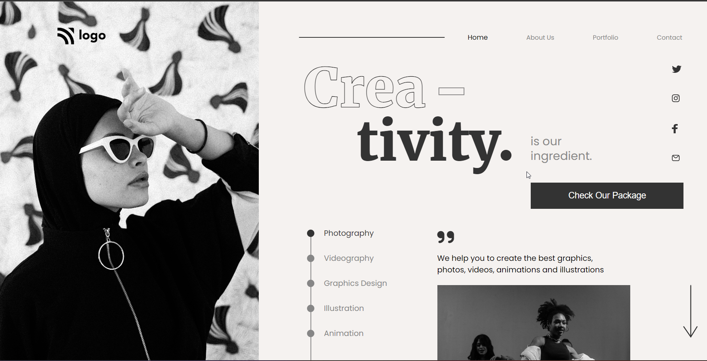

# Assignment-14-HTML  and CSS 

## PROJECT-14 - [Go Live ](https://full-stack-js-proj-14.netlify.app/)

---

### Skills Gained in this project

- Since this project is heavily based on positioning, Learned a lot about relative & absolute.
- Learned to use text-stroke-width to create outline text effect.
- Also Learned to create stepper using list item & div (By using relative & absolute)

---

## Time taken to finish this project

- 5 hour taken to complete it.

#### Screenshot

